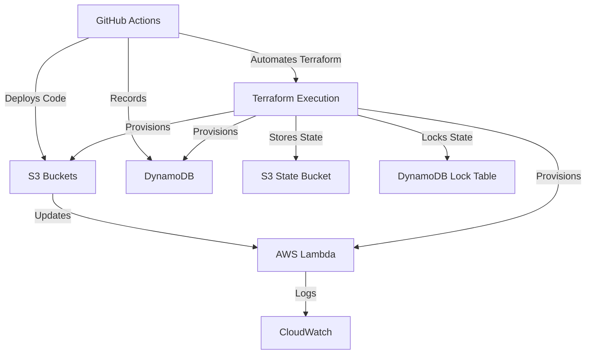
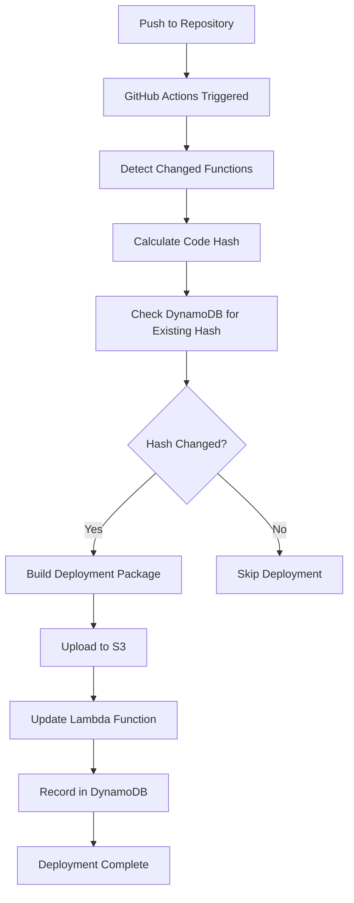

# AWS MonoLambda Deployment

Deploy AWS Lambda functions from a monolithic repository using GitHub Actions with intelligent change detection and deployment tracking.

## 🚀 Features

- **Monorepo Support**: Deploy multiple Lambda functions from a single repository
- **Change Detection**: Only deploy functions that have been modified
- **DynamoDB Tracking**: Track deployments and code hashes to prevent unnecessary deployments
- **Multi-Environment**: Support for multiple environments (dev, staging, prod)
- **GitHub Actions Integration**: Automated CI/CD pipeline for both code deployment and infrastructure management
- **Terraform Infrastructure**: Infrastructure as Code for AWS resources, automated via GitHub Actions

## Table of Contents
- [Repository Structure](#-repository-structure)
- [Infrastructure](#-infrastructure)
- [Setup](#-setup)
- [Deployment](#-deployment)
- [Lambda Function Structure](#-lambda-function-structure)
- [Configuration](#-configuration)
- [Testing](#-testing)
- [Monitoring](#-monitoring)
- [Contributing](#-contributing)
- [Key Metrics](#-key-metrics)
- [Business Value](#-business-value)
- [Scalability](#-scalability)
- [Tech Stack](#-tech-stack)
- [Related Resources](#-related-resources)

## 📁 Repository Structure

```
├── .github/
│   └── workflows/
│       └── github-actions-deploy.yml
├── build_scripts/
│   └── deploy_lambdas.py
├── lambdas/
│   ├── lambda-a/
│   ├── lambda-b/
│   └── lambda-c/
├── terraform/
│   ├── main.tf
│   ├── provider.tf
│   ├── environments.tf
│   ├── backend.tf
│   └── modules/
│       └── lambda/
│           ├── dummy/
│           ├── main.tf
│           ├── outputs.tf
│           ├── variables.tf
│   ├── terraform.tfstate*
├── terraform-state-setup/
│   └── main.tf
├── .gitignore
├── README.md
```

## 🏗️ Infrastructure

### Architecture Overview



### DynamoDB Table for Deployment Tracking
Tracks Lambda deployments with the following schema:
- **Primary Key**: `deployment_id` (hash) + `environment` (range)
- **GSI**: `function_name` + `environment` for querying by function
- **Attributes**: `code_hash`, `deployed_at`, `commit_id`, `branch_name`, `developer`

### Terraform State Management
Terraform state is managed remotely using an S3 bucket for storage and a DynamoDB table for state locking to prevent concurrent modifications. This ensures consistency and security across automated and local Terraform operations.

## 🔧 Setup

### 1. Prerequisites
- AWS Account with appropriate permissions
- GitHub repository
- Terraform installed (for local development or initial setup)

### 2. Configure GitHub Secrets
Add the following secrets to your GitHub repository:

```
AWS_ACCESS_KEY_ID
AWS_SECRET_ACCESS_KEY
```

### 3. Configure Repository Variables
Add these variables in GitHub Settings:

```
S3_BUCKET_DEV = your dev bucket
S3_BUCKET_QA = your qa bucket
S3_BUCKET_PROD = your prod bucket
```

### 4. Set Up Terraform State Backend (Initial Setup)
Before automating Terraform with GitHub Actions, set up the state backend:
1. Navigate to `terraform-state-setup` directory.
2. Run `terraform init`, `terraform plan`, and `terraform apply` to create the S3 bucket and DynamoDB table for state management.
3. Update `terraform/backend.tf` with the correct bucket and table names if different from defaults.
4. Run `terraform init` in the `terraform` directory to migrate state to the S3 backend.

## 🚀 Deployment

### Infrastructure Deployment with GitHub Actions
Infrastructure management is automated using Terraform through GitHub Actions. The workflow handles:
- **Terraform Plan**: Generates a plan for infrastructure changes on push (with `[terraform]` in commit message) or manual dispatch.
- **Terraform Apply**: Applies changes only on manual dispatch with explicit approval (`apply_terraform=true`), ensuring control over infrastructure modifications.

### Code Deployment with GitHub Actions

#### Automatic Deployment
The GitHub Actions workflow automatically handles code deployment for Lambda functions after infrastructure is set up:

1. **Detects Changes**: Identifies modified Lambda functions
2. **Builds Packages**: Creates deployment packages for changed functions
3. **Checks Hashes**: Compares with previously deployed versions
4. **Deploys**: Updates only functions with code changes to S3 and Lambda
5. **Records**: Tracks deployments in DynamoDB

#### Manual Deployment
Trigger code or infrastructure deployments manually through GitHub Actions:

1. Go to **Actions** tab in your repository
2. Select the deployment workflow
3. Click **Run workflow**
4. Choose environment and whether to apply Terraform changes

> **Important Note**: If it's your first time running the project, deploy manually each stage in GitHub Actions to update your Lambda code and save its code hash to DynamoDB. Initial Terraform deployment creates AWS Lambda with dummy code.

### Deployment Process for Code Updates



## 📝 Lambda Function Structure

Each Lambda function should follow a structure like this:

```
lambdas/function-name/
├── lambda_function.py      # Main handler
├── requirements.txt        # Python dependencies
├── config.json            # Function configuration (optional)
└── tests/                 # Unit tests (optional)
    └── test_function.py
```

### Example Lambda Function

```python
import json
import boto3

def lambda_handler(event, context):
    """
    Main Lambda handler function
    """
    try:
        # Your function logic here
        result = process_event(event)
        
        return {
            'statusCode': 200,
            'body': json.dumps(result)
        }
    except Exception as e:
        return {
            'statusCode': 500,
            'body': json.dumps({'error': str(e)})
        }

def process_event(event):
    # Function implementation
    return {'message': 'Success'}
```

## 🔧 Configuration

### GitHub Actions Workflow

The workflow supports:
- **Multiple triggers**: Push, Pull Request, Manual
- **Environment selection**: Choose target environment
- **Conditional deployment**: Based on file changes or commit messages
- **Parallel processing**: Deploy multiple functions simultaneously
- **Terraform automation**: Plan and apply infrastructure changes with approval

## 🧪 Testing

### Local Testing
In progress...

### Integration Testing
In progress...

## 🔍 Monitoring

### CloudWatch Logs
Each Lambda function automatically logs to CloudWatch:
- Function execution logs
- Error tracking
- Performance metrics

### DynamoDB Tracking
Monitor deployments through the `lambda-deployments` table:
- Deployment history
- Code change tracking
- Environment status

## 🤝 Contributing

1. Fork the repository
2. Create a feature branch
3. Add your Lambda function to the `lambdas/` directory
4. Update documentation if needed
5. Submit a pull request

## 🎯 Key Metrics
- ⚡ **80% faster deployments** with change detection
- 💰 **90% cost reduction** by avoiding unnecessary deployments  
- 🔄 **Zero-downtime** deployments across environments
- 📊 **100% deployment visibility** with DynamoDB tracking

## 💼 Business Value
This system solves common enterprise challenges:
- **Developer Productivity**: Teams can work independently on different functions
- **Cost Optimization**: Only deploy what changed, reducing compute costs
- **Risk Mitigation**: Track every deployment with rollback capabilities
- **Compliance**: Full audit trail of all infrastructure changes

## 📈 Scalability
- Supports **100+ Lambda functions** in a single repository
- **Sub-5-minute** deployment times for changed functions
- Handles **multiple teams** working simultaneously

## 🛠️ Tech Stack


## 🔗 Related Resources

- [AWS Lambda Documentation](https://docs.aws.amazon.com/lambda/)
- [GitHub Actions Documentation](https://docs.github.com/en/actions)
- [Terraform AWS Provider](https://registry.terraform.io/providers/hashicorp/aws/latest/docs)

---

**Note**: This repository demonstrates a scalable approach to managing multiple Lambda functions in a monorepo with automated code and infrastructure deployment pipelines via GitHub Actions. Terraform state is securely managed using S3 and DynamoDB for consistency and locking.
